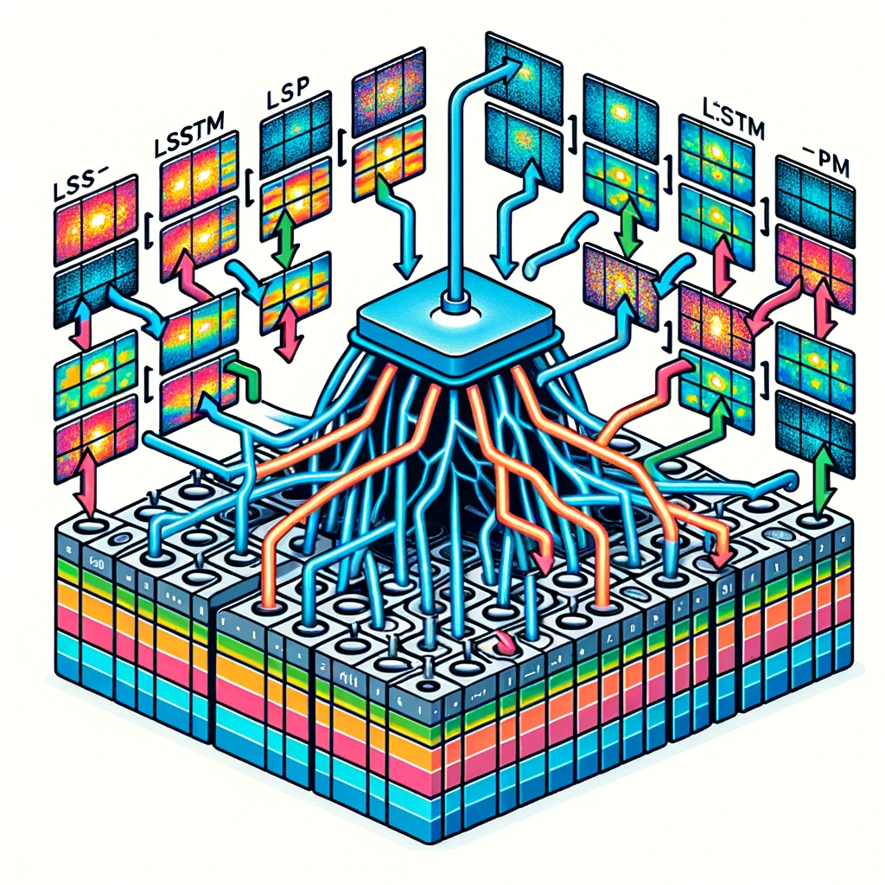

# Navi RNN

## data
This folder contains:
- `labels` : true labels for a series of videos, which were labeled back-to-back. Each csv file contains ranges specifying when a class (0 : no spur | 1 : spur) starts and ends.
- `maps/mapping.csv` : mapping of functional_id's and their corresponding video folder
- `videos` : the videos from endoscopic procedures

## prep 
This folder contains:
- `weights/` weights of a trained model (using a simple cnn architecture at present time)
- `label_acquisition.ipynb` : a notebook for collecting labels by running inference (weights from pretrained model) on the frames of each videos. These labels are to be considered as automatically obtained, and are meant to be used in self-supervised learning model, as a proxy. Note that they are not real labels, i.e. no manual annotations was done for them.
- `predictions.json` : the obtained annotations

## src
This folder contains:
- `cnn` : the cnn architecture
- `rcnn` : the rcnn architecture, based on cnn and lstm
- `VideoSequenceDataset` : the Dataset class, that uses a frame number and its label

## train
The main program for training the rcnn model

## inference
The main program for running inference on true labels (see `data/labels`) and giving a score to the model.

## Run the code
Example of how to launch the program:
    - python main.py --w_b_api_key a64b32e1f56e76998845a8ec40f28c1292986e31 --SLURM_ARRAY_TASK_ID 0
    -  python train_rnn_with_embeddings.py --model-name navi_lstm --embeddings-dir /home/rob/Documents/Github/navi_lstm/processing/output --fold-nb 0 --video-csv /home/rob/Documents/Github/navi_lstm/data/maps/mapping.csv --label-map /home/rob/Documents/Github/navi_lstm/prep/predictions.json --snapshot-dir /home/rob/Documents/Github/navi_lstm/output/snapshot